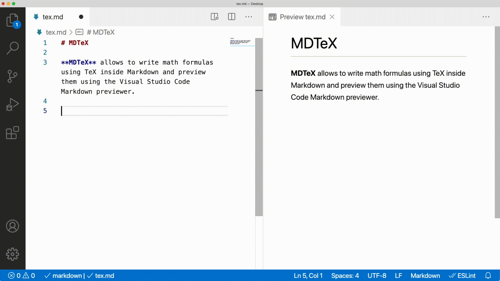

# MDTeX for Visual Studio Code

[](https://marketplace.visualstudio.com/items?itemName=MrF3lix.mdtex)
[](https://github.com/MrF3lix/mdtex)
[](https://github.com/MrF3lix/mdtex/actions)

**MDTeX** allows to write math formulas using TeX inside Markdown and preview them using the Visual Studio Code Markdown previewer.

## Features

- Use TeX formulas inside Markdown.
- Auto save as HTML.
- Custom Markdown styles.
- Custom code highlight styles.

## How to use

Use the defined delimiters to wrap your math formulas.



## Extension Settings

This extension contributes the following settings:

|Name|Description|Default Value|
|-|-|-|
|`mdtex.delimiters`|Sets the math formula delimiters (see available delimiters)|`dollars`|
|`mdtex.autoSaveAsHtml`|Automatically generates HTML from MD files|`false`|
|`mdtex.autoSaveAsHtmlDir`|Path to save the generated HTML to, relative to the source file|`""`|
|`mdtex.codeHighlightStylesheet`|Code highlight stylesheet|`https://cdnjs.cloudflare.com/ajax/libs/highlight.js/10.5.0/styles/github-gist.min.css`|
|`mdtex.markdownStylesheet`|Markdown stylesheet|`https://cdnjs.cloudflare.com/ajax/libs/github-markdown-css/4.0.0/github-markdown.min.css`|
|`mdtex.customStylesheet`|Custom styles sheet|`""`|

### Available Delimiters

|Name|Inline|Block|Numebred|
|-|-|-|-|
|`dollars`|`$...$`|`$$...$$`|`$$...$$(1)`|
|`brackets`|`\(...\)`|`\[...\]`|`\[...\](1)`|
|`gitlab`|`$...$`|` ```math ... ``` `|` ```math ... ``` (1)`|
|`julia`|`$...$` or ` ``...`` `|` ```math ... ``` `|` ```math ... ``` (1)`|
|`kramdown`|`$$...$$`|`$$...$$`|`$$...$$(1)`|
